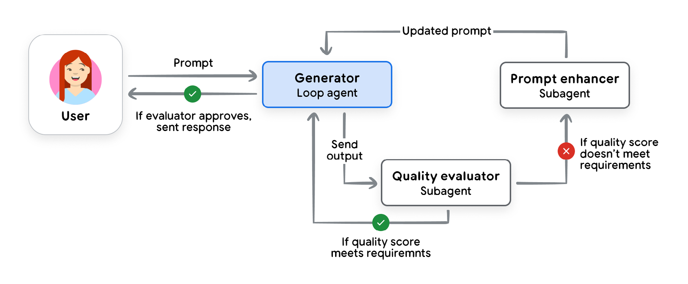
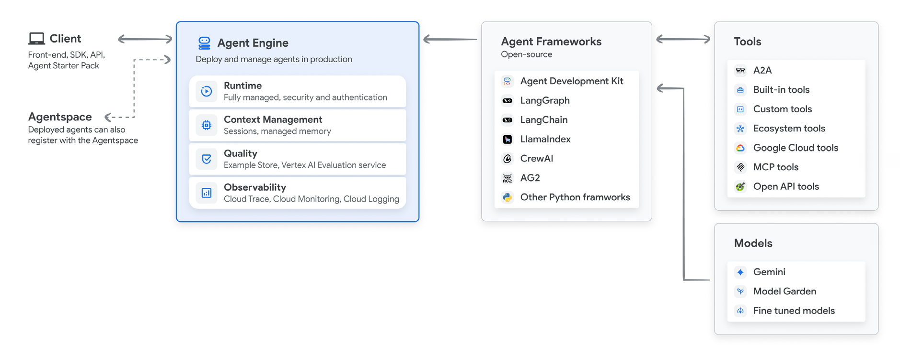
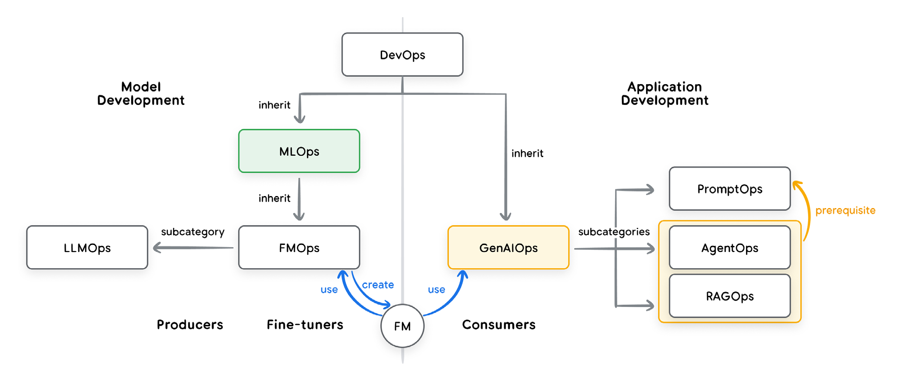
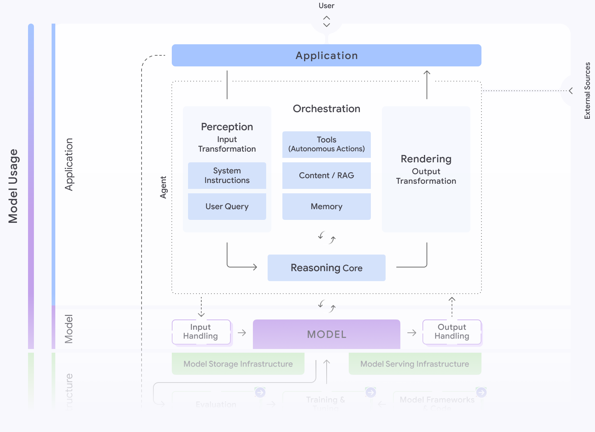
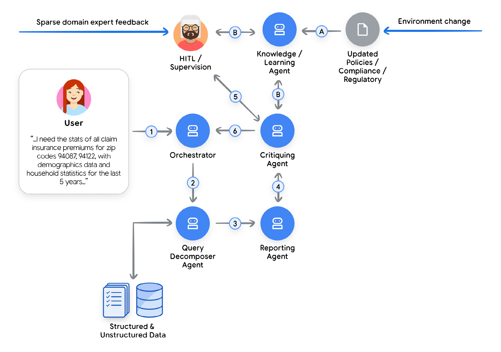

# Core Agent Architecture: Model, Tools, and Orchestration | <mark>核心智能体架构：模型、工具与编排</mark>

---

## Introduction to Agents and Agent Architectures | <mark>智能体及其架构简介</mark>

**November 2025**

---

## Core Agent Architecture: Model, Tools, and Orchestration | <mark>核心智能体架构：模型、工具与编排</mark>

We know what an agent does and how it can scale. But how do we actually build it? The transition from concept to code lies in the specific architectural design of its three core components.

<mark>我们知道智能体做什么以及如何扩展。但我们如何实际构建它？从概念到代码的转变在于其三个核心组件的具体架构设计。</mark>

---

## Model: The "Brain" of your AI Agent | <mark>模型：AI 智能体的"大脑"</mark>

The LM is the reasoning core of your agent, and its selection is a critical architectural decision that dictates your agent's cognitive capabilities, operational cost, and speed. However, treating this choice as a simple matter of picking the model with the highest benchmark score is a common path to failure. An agent's success in a production environment is rarely determined by generic academic benchmarks.

<mark>LM 是智能体的推理核心，其选择是一个关键的架构决策，决定了智能体的认知能力、运营成本和速度。然而，将这一选择视为简单地挑选基准分数最高的模型，是通往失败的常见路径。智能体在生产环境中的成功很少由通用学术基准决定。</mark>

Real-world success demands a model that excels at agentic fundamentals: superior reasoning to navigate complex, multi-step problems and reliable tool use to interact with the world⁷.

<mark>现实世界的成功需要一个在智能体基础方面表现出色的模型：卓越的推理能力来处理复杂的多步骤问题，以及可靠的工具使用能力来与世界交互⁷。</mark>

To do this well, start by defining the business problem, then test models against metrics that directly map to that outcome. If your agent needs to write code, test it on your private codebase. If it processes insurance claims, evaluate its ability to extract information from your specific document formats. This analysis must then be cross-referenced with the practicalities of cost and latency. The "best" model is the one that sits at the optimal intersection of quality, speed, and price for your specific task⁸.

<mark>要做好这一点，首先要定义业务问题，然后针对直接映射到该结果的指标测试模型。如果你的智能体需要编写代码，请在你的私有代码库上测试它。如果它处理保险索赔，请评估其从特定文档格式中提取信息的能力。然后必须将此分析与成本和延迟的实际情况交叉参考。"最佳"模型是在质量、速度和价格的最佳交叉点上，针对你的特定任务⁸。</mark>

You may choose more than one model, a "team of specialists." You don't use a sledgehammer to crack a nut. A robust agent architecture might use a frontier model like Gemini 2.5 Pro for the heavy lifting of initial planning and complex reasoning, but then intelligently route simpler, high-volume tasks—like classifying user intent or summarizing text—to a much faster and more cost-effective model like Gemini 2.5 Flash. Model routing might be automatic or hard-coded but is a key strategy for optimizing both performance and cost⁹.

<mark>你可以选择多个模型，一个"专家团队"。你不会用大锤砸坚果。一个稳健的智能体架构可能会使用像 Gemini 2.5 Pro 这样的前沿模型来完成初始规划和复杂推理的繁重工作，然后智能地将更简单、高容量的任务——如分类用户意图或总结文本——路由到像 Gemini 2.5 Flash 这样更快且更具成本效益的模型。模型路由可能是自动的或硬编码的，但这是优化性能和成本的关键策略⁹。</mark>

The same principle applies to handling diverse data types. While a natively multimodal model like Gemini live mode¹⁰ offers a streamlined path to processing images and audio, an alternative is to use specialized tools like the Cloud Vision API¹¹ or Speech-to-Text API¹². In this pattern, the world is first converted to text, which is then passed to a language-only model for reasoning. This adds flexibility and allows for best-of-breed components, but also introduces significant complexity.

<mark>同样的原则适用于处理多样化的数据类型。虽然像 Gemini 实时模式¹⁰ 这样的原生多模态模型提供了处理图像和音频的简化路径，但另一种选择是使用像 Cloud Vision API¹¹ 或 Speech-to-Text API¹² 这样的专业工具。在这种模式中，世界首先被转换为文本，然后传递给仅支持语言的模型进行推理。这增加了灵活性并允许使用最佳组件，但也引入了显著的复杂性。</mark>

Finally, the AI landscape is in a state of constant, rapid evolution. The model you choose today will be superseded in six months. A "set it and forget it" mindset is unsustainable. Building for this reality means investing in a nimble operational framework—an "Agent Ops" practice¹³. With a robust CI/CD pipeline that continuously evaluates new models against your key business metrics, you can de-risk and accelerate upgrades, ensuring your agent is always powered by the best brain available without requiring a complete architectural overhaul.

<mark>最后，AI 领域处于持续快速发展的状态。你今天选择的模型将在六个月后被取代。"一劳永逸"的心态是不可持续的。为这一现实构建意味着投资于一个敏捷的运营框架——"Agent Ops"实践¹³。通过一个稳健的 CI/CD 管道，持续针对你的关键业务指标评估新模型，你可以降低风险并加速升级，确保你的智能体始终由可用的最佳大脑提供支持，而无需进行完整的架构改革。</mark>

---

## Tools: The "Hands" of your AI Agent | <mark>工具：AI 智能体的"双手"</mark>

If the model is the agent's brain, tools are the hands that connect its reasoning to reality. They allow the agent to move beyond its static training data to retrieve real-time information and take action in the world. A robust tool interface is a three-part loop: defining what a tool can do, invoking it, and observing the result.

<mark>如果模型是智能体的大脑，那么工具就是将其推理与现实连接起来的双手。它们允许智能体超越其静态训练数据，检索实时信息并在世界中采取行动。一个稳健的工具接口是一个三部分循环：定义工具可以做什么、调用它以及观察结果。</mark>

Here are a few of the main types of tools agent builders will put into the "hands" of their agents. For a more complete deep dive see the agent tools focused whitepaper in this series.

<mark>以下是智能体构建者将放入其智能体"双手"的主要工具类型。有关更完整的深入了解，请参阅本系列中专注于智能体工具的白皮书。</mark>

### Retrieving Information: Grounding in Reality | <mark>检索信息：扎根于现实</mark>

The most foundational tool is the ability to access up-to-date information. Retrieval-Augmented Generation (RAG) gives the agent a "library card" to query external knowledge, often stored in Vector Databases or Knowledge Graphs, ranging from internal company documents to web knowledge via Google Search. For structured data, Natural Language to SQL (NL2SQL) tools allow the agent to query databases to answer analytic questions like, "What were our top-selling products last quarter?" By looking things up before speaking—whether in a document or a database—the agent grounds itself in fact, dramatically reducing hallucinations.

<mark>最基础的工具是访问最新信息的能力。检索增强生成 (Retrieval-Augmented Generation, RAG) 为智能体提供了一张"图书馆卡"来查询外部知识，通常存储在向量数据库 (Vector Databases) 或知识图谱 (Knowledge Graphs) 中，从内部公司文档到通过 Google 搜索的网络知识。对于结构化数据，自然语言转 SQL (Natural Language to SQL, NL2SQL) 工具允许智能体查询数据库以回答分析问题，如"我们上个季度的畅销产品是什么？"通过在说话之前查找——无论是在文档还是数据库中——智能体将自己扎根于事实，大大减少了幻觉。</mark>

### Executing Actions: Changing the World | <mark>执行操作：改变世界</mark>

The true power of agents is unleashed when they move from reading information to actively doing things. By wrapping existing APIs and code functions as tools, an agent can send an email, schedule a meeting, or update a customer record in ServiceNow. For more dynamic tasks, an agent can write and execute code on the fly. In a secure sandbox, it can generate a SQL query or a Python script to solve a complex problem or perform a calculation, transforming it from a knowledgeable assistant into an autonomous actor¹⁴.

<mark>智能体的真正力量在于它们从阅读信息转向主动做事时释放出来。通过将现有的 API 和代码函数包装为工具，智能体可以发送电子邮件、安排会议或更新 ServiceNow 中的客户记录。对于更动态的任务，智能体可以即时编写和执行代码。在安全沙箱中，它可以生成 SQL 查询或 Python 脚本来解决复杂问题或执行计算，将其从知识渊博的助手转变为自主行动者¹⁴。</mark>

This also includes tools for human interaction. An agent can use a Human in the Loop (HITL) tool to pause its workflow and ask for confirmation (e.g., ask_for_confirmation()) or request specific information from a user interface (e.g., ask_for_date_input()), ensuring a person is involved in critical decisions. HITL could be implemented via SMS text messaging and a task in a database.

<mark>这还包括用于人机交互的工具。智能体可以使用人在回路中 (Human in the Loop, HITL) 工具来暂停其工作流并请求确认（例如，ask_for_confirmation()）或从用户界面请求特定信息（例如，ask_for_date_input()），确保人参与关键决策。HITL 可以通过 SMS 短信和数据库中的任务来实现。</mark>

### Function Calling: Connecting Tools to your Agent | <mark>函数调用：将工具连接到智能体</mark>

For an agent to reliably do "function calling" and use tools, it needs clear instructions, secure connections, and orchestration¹⁵. Longstanding standards like the OpenAPI specification provide this, giving the agent a structured contract that describes a tool's purpose, its required parameters, and its expected response. This schema lets the model generate the correct function call every time and interpret the API response. For simpler discovery and connection to tools, open standards like the Model Context Protocol (MCP) have become popular because they are more convenient¹⁶. Additionally, a few models have native tools, like Gemini with native Google Search, where the function invocation happens as part of the LM call itself¹⁷.

<mark>为了让智能体可靠地执行"函数调用 (Function Calling)"并使用工具，它需要清晰的指令、安全的连接和编排¹⁵。像 OpenAPI 规范这样的长期标准提供了这一点，为智能体提供了一个结构化的契约，描述工具的用途、所需参数和预期响应。此模式让模型每次都能生成正确的函数调用并解释 API 响应。为了更简单地发现和连接工具，像模型上下文协议 (Model Context Protocol, MCP) 这样的开放标准因其更加便捷而变得流行¹⁶。此外，一些模型有原生工具，如 Gemini 的原生 Google 搜索，其中函数调用作为 LM 调用本身的一部分发生¹⁷。</mark>

---

## The Orchestration Layer | <mark>编排层</mark>

If the model is the agent's brain and the tools are its hands, the orchestration layer is the central nervous system that connects them. It is the engine that runs the "Think, Act, Observe" loop, the state machine that governs the agent's behavior, and the place where a developer's carefully crafted logic comes to life. This layer is not just plumbing; it is the conductor of the entire agentic symphony, deciding when the model should reason, which tool should act, and how the results of that action should inform the next movement.

<mark>如果模型是智能体的大脑，工具是其双手，那么编排层就是连接它们的中枢神经系统。它是运行"思考、行动、观察"循环的引擎，是治理智能体行为的状态机，也是开发者精心制作的逻辑变为现实的地方。这一层不仅仅是管道；它是整个智能体交响乐的指挥，决定模型何时应该推理、哪个工具应该行动，以及该行动的结果应该如何告知下一步行动。</mark>

### Core Design Choices | <mark>核心设计选择</mark>

The first architectural decision is determining the agent's degree of autonomy. The choice exists on a spectrum. At one end, you have deterministic, predictable workflows that call an LM as a tool for a specific task—a sprinkle of AI to augment an existing process. At the other end, you have the LM in the driver's seat, dynamically adapting, planning and executing tasks to achieve a goal.

<mark>第一个架构决策是确定智能体的自主程度。这一选择存在于一个光谱上。一端是确定性的、可预测的工作流，将 LM 作为特定任务的工具调用——在现有流程中点缀 AI。另一端是 LM 处于驾驶席，动态适应、规划和执行任务以实现目标。</mark>

A parallel choice is the implementation method. No-code builders offer speed and accessibility, empowering business users to automate structured tasks and build simple agents rapidly. For more complex, mission-critical systems, code-first frameworks, such as Google's Agent Development Kit (ADK)¹⁸, provide the deep control, customizability, and integration capabilities that engineers require.

<mark>一个平行的选择是实现方法。无代码构建器提供速度和可访问性，赋能业务用户快速自动化结构化任务并构建简单智能体。对于更复杂、关键任务的系统，代码优先框架，如 Google 的智能体开发套件 (Agent Development Kit, ADK)¹⁸，提供工程师所需的深度控制、可定制性和集成能力。</mark>

Regardless of the approach, a production-grade framework is essential. It must be open, allowing you to plug in any model or tool to prevent vendor lock-in. It must provide precise control, enabling a hybrid approach where the non-deterministic reasoning of an LM is governed by hard-coded business rules. Most importantly, the framework must be built for observability. When an agent behaves unexpectedly, you cannot simply put a breakpoint in the model's "thought." A robust framework generates detailed traces and logs, exposing the entire reasoning trajectory: the model's internal monologue, the tool it chose, the parameters it generated, and the result it observed.

<mark>无论采用哪种方法，生产级框架都是必不可少的。它必须是开放的，允许你插入任何模型或工具以防止供应商锁定。它必须提供精确控制，支持混合方法，其中 LM 的非确定性推理由硬编码的业务规则治理。最重要的是，框架必须为可观察性而构建。当智能体表现异常时，你不能简单地在模型的"思考"中放置断点。一个稳健的框架生成详细的跟踪和日志，暴露整个推理轨迹：模型的内部独白、它选择的工具、它生成的参数以及它观察到的结果。</mark>

### Instruct with Domain Knowledge and Persona | <mark>使用领域知识和人设进行指导</mark>

Within this framework, the developer's most powerful lever is to instruct the agent with domain knowledge and a distinct persona. This is accomplished through a system prompt or a set of core instructions. This isn't just a simple command; it is the agent's constitution.

<mark>在这个框架内，开发者最强大的杠杆是使用领域知识和独特人设来指导智能体。这是通过系统提示或一组核心指令来完成的。这不仅仅是一个简单的命令；它是智能体的宪法。</mark>

Here, you tell it, "You are a helpful customer support agent for Acme Corp, ..." and provide constraints, desired output schema, rules of engagement, a specific tone of voice, and explicit guidance on when and why it should use its tools. A few example scenarios in the instructions are usually very effective.

<mark>在这里，你告诉它，"你是 Acme Corp 的有用客户支持智能体，..."并提供约束、期望的输出模式、参与规则、特定的语气以及关于何时以及为何应该使用其工具的明确指导。指令中的几个示例场景通常非常有效。</mark>

### Augment with Context | <mark>通过上下文增强</mark>

The agent's "memory" is orchestrated into the LM context window at runtime. For a more complete deep dive see the agent memory focused whitepaper in this series.

<mark>智能体的"记忆"在运行时被编排到 LM 上下文窗口中。有关更完整的深入了解，请参阅本系列中专注于智能体记忆的白皮书。</mark>

Short-term memory is the agent's active "scratchpad," maintaining the running history of the current conversation. It tracks the sequence of (Action, Observation) pairs from the ongoing loop, providing the immediate context the model needs to decide what to do next. This may be implemented as abstractions like state, artifacts, sessions or threads.

<mark>短期记忆 (Short-term Memory) 是智能体的活动"草稿本"，维护当前对话的运行历史。它跟踪持续循环中的（行动、观察）对序列，提供模型决定下一步做什么所需的即时上下文。这可以作为状态、工件、会话或线程等抽象来实现。</mark>

Long-term memory provides persistence across sessions. Architecturally, this is almost always implemented as another specialized tool—a RAG system connected to a vector database or search engine. The orchestrator gives the agent the ability to pre-fetch and to actively query its own history, allowing it to "remember" a user's preferences or the outcome of a similar task from weeks ago for a truly personalized and continuous experience¹⁹.

<mark>长期记忆 (Long-term Memory) 提供跨会话的持久性。在架构上，这几乎总是作为另一个专业工具来实现——连接到向量数据库或搜索引擎的 RAG 系统。编排器赋予智能体预取和主动查询自己历史的能力，允许它"记住"用户的偏好或几周前类似任务的结果，以获得真正个性化和连续的体验¹⁹。</mark>

---

## Multi-Agent Systems and Design Patterns | <mark>多智能体系统与设计模式</mark>

As tasks grow in complexity, building a single, all-powerful "super-agent" becomes inefficient. The more effective solution is to adopt a "team of specialists" approach, which mirrors a human organization. This is the core of a multi-agent system: a complex process is segmented into discrete sub-tasks, and each is assigned to a dedicated, specialized AI agent. This division of labor allows each agent to be simpler, more focused, and easier to build, test, and maintain, which is ideal for dynamic or long-running business processes.

<mark>随着任务复杂性的增长，构建单一的、全能的"超级智能体"变得低效。更有效的解决方案是采用"专家团队"方法，这反映了人类组织。这是多智能体系统 (Multi-Agent System) 的核心：复杂过程被分割成离散的子任务，每个子任务都分配给一个专门的、专业化的 AI 智能体。这种分工使每个智能体更简单、更专注，更易于构建、测试和维护，非常适合动态或长期运行的业务流程。</mark>

Architects may rely on proven agentic design patterns, though agent capabilities and thus patterns are evolving rapidly²⁰. For dynamic or non-linear tasks, the Coordinator pattern is essential. It introduces a "manager" agent that analyzes a complex request, segments the primary task, and intelligently routes each sub-task to the appropriate specialist agent (like a researcher, a writer, or a coder). The coordinator then aggregates the responses from each specialist to formulate a final, comprehensive answer.

<mark>架构师可能依赖已验证的智能体设计模式 (Agentic Design Patterns)，尽管智能体能力因此模式正在快速发展²⁰。对于动态或非线性任务，协调器模式 (Coordinator Pattern) 是必不可少的。它引入了一个"管理者"智能体，分析复杂请求，分割主要任务，并智能地将每个子任务路由到适当的专家智能体（如研究员、作家或编码员）。然后协调器汇总每个专家的响应，形成最终的全面答案。</mark>

---

[IMAGE_3: image_003_page_25_1.png - 位于第 25 页]

**Figure 3: The "iterative refinement" pattern from https://cloud.google.com/architecture/choose-design-pattern-agentic-ai-system**

<mark>**图 3："迭代细化"模式，来自 https://cloud.google.com/architecture/choose-design-pattern-agentic-ai-system**</mark>

---

For more linear workflows, the Sequential pattern is a better fit, acting like a digital assembly line where the output from one agent becomes the direct input for the next. Other key patterns focus on quality and safety. The Iterative Refinement pattern creates a feedback loop, using a "generator" agent to create content and a "critic" agent to evaluate it against quality standards. For high-stakes tasks, the Human-in-the-Loop (HITL) pattern is critical, creating a deliberate pause in the workflow to get approval from a person before an agent takes a significant action.

<mark>对于更线性的工作流，顺序模式 (Sequential Pattern) 更合适，像一条数字装配线，一个智能体的输出成为下一个智能体的直接输入。其他关键模式专注于质量和安全。迭代细化模式 (Iterative Refinement Pattern) 创建一个反馈循环，使用"生成器"智能体创建内容，使用"评论家"智能体根据质量标准进行评估。对于高风险任务，人在回路中 (Human-in-the-Loop, HITL) 模式至关重要，在智能体采取重大行动之前，在工作流中创建一个有意的暂停以获得人的批准。</mark>

---

## Agent Deployment and Services | <mark>智能体部署与服务</mark>

After you have built a local agent, you will want to deploy it to a server where it runs all the time and where other people and agents can use it. Continuing our analogy, deployment and services would be the body and legs for our agent. An agent requires several services to be effective, session history and memory persistence, and more. As an agent builder, you will also be responsible for deciding what you log, and what security measures you take for data privacy and data residency and regulation compliance. All of these services are in scope, when deploying agents to production.

<mark>在构建本地智能体之后，你将希望将其部署到一个服务器上，在那里它一直运行，其他人和智能体可以使用它。继续我们的类比，部署和服务将是我们智能体的身体和腿。智能体需要几个服务才能有效，如会话历史和记忆持久化等。作为智能体构建者，你还将负责决定记录什么，以及采取什么安全措施来保护数据隐私、数据驻留和法规合规性。所有这些服务都在范围内，当将智能体部署到生产环境时。</mark>

Luckily, agent builders can rely on decades of application hosting infrastructure. Agents are a new form of software after all and many of the same principles apply. Builders can rely on purpose-built, agent specific, deployment options like Vertex AI Agent Engine which support runtime and everything else in one platform²¹. For software developers who want to control their application stacks more directly, or deploy agents within their existing DevOps infrastructure, any agent and most agent services can be added to a docker container and deployed onto industry standard runtimes like Cloud Run or GKE²².

<mark>幸运的是，智能体构建者可以依赖数十年的应用托管基础设施。智能体毕竟是一种新形式的软件，许多相同的原则都适用。构建者可以依赖专门构建的、特定于智能体的部署选项，如 Vertex AI Agent Engine，它在一个平台中支持运行时和其他所有内容²¹。对于希望更直接控制其应用堆栈或在现有 DevOps 基础设施中部署智能体的软件开发人员，任何智能体和大多数智能体服务都可以添加到 docker 容器中，并部署到像 Cloud Run 或 GKE²² 这样的行业标准运行时上。</mark>

---

[IMAGE_4: image_004_page_27_1.png - 位于第 27 页]

**Figure 4: Vertex AI Agent builder from https://cloud.google.com/vertex-ai/generative-ai/docs/agent-engine/overview**

<mark>**图 4：Vertex AI Agent 构建器，来自 https://cloud.google.com/vertex-ai/generative-ai/docs/agent-engine/overview**</mark>

---

If you are not a software developer and a DevOps expert, the process of deploying your first agent might be daunting. Many agent frameworks make this easy with a deploy command or a dedicated platform to deploy the agent, and these should be used for early exploration and onboarding. Ramping up to a secure and production ready environment will usually require a bigger investment of time and application of best practices, including CI/CD and automated testing for your agents²³.

<mark>如果你不是软件开发人员和 DevOps 专家，部署第一个智能体的过程可能令人生畏。许多智能体框架通过部署命令或专用平台来部署智能体，使这变得容易，这些应该用于早期探索和入职。提升到安全且生产就绪的环境通常需要更大的时间投资和最佳实践的应用，包括 CI/CD 和智能体的自动化测试²³。</mark>

---

## Agent Ops: A Structured Approach to the Unpredictable | <mark>Agent Ops：应对不可预测性的结构化方法</mark>

As you build your first agents, you will be manually testing the behavior, over and over again. When you add a feature, does it work? When you fix a bug, did you cause a different problem? Testing is normal for software development but it works differently with generative AI.

<mark>当你构建第一个智能体时，你将一遍又一遍地手动测试行为。当你添加功能时，它能工作吗？当你修复错误时，你是否引起了不同的问题？测试对于软件开发是正常的，但在生成式 AI 中它的工作方式不同。</mark>

---

[IMAGE_5: image_005_page_28_1.png - 位于第 28 页]

**Figure 5: Relationships between the operational domains of DevOps, MLOps, and GenAIOps from https://medium.com/@sokratis.kartakis/genai-in-production-mlops-or-genaiops-25691c9becd0**

<mark>**图 5：DevOps、MLOps 和 GenAIOps 运营领域之间的关系，来自 https://medium.com/@sokratis.kartakis/genai-in-production-mlops-or-genaiops-25691c9becd0**</mark>

---

The transition from traditional, deterministic software to stochastic, agentic systems requires a new operational philosophy. Traditional software unit tests could simply assert output == expected; but that doesn't work when an agent's response is probabilistic by design. Also, because language is complicated, it usually requires a LM to evaluate "quality" – that the agent's response does all of what it should, nothing it shouldn't, and with proper tone.

<mark>从传统的确定性软件过渡到随机的智能体系统需要一种新的运营哲学。传统软件单元测试可以简单地断言 output == expected；但当智能体的响应设计上是概率性的时，这不起作用。此外，由于语言复杂，通常需要 LM 来评估"质量"——智能体的响应做了它应该做的所有事情，没有做它不应该做的事情，并且具有适当的语气。</mark>

Agent Ops is the disciplined, structured approach to managing this new reality. It is a natural evolution of DevOps and MLOps, tailored for the unique challenges of building, deploying, and governing AI agents, turning unpredictability from a liability into a managed, measurable, and reliable feature²⁴. For a more complete deep dive see the agent quality focused whitepaper in this series.

<mark>Agent Ops 是管理这一新现实的有纪律的、结构化的方法。它是 DevOps 和 MLOps 的自然演进，针对构建、部署和治理 AI 智能体的独特挑战而定制，将不可预测性从负债转变为可管理、可测量和可靠的功能²⁴。有关更完整的深入了解，请参阅本系列中专注于智能体质量的白皮书。</mark>

### Measure What Matters: Instrumenting Success Like an A/B Experiment | <mark>衡量重要指标：像 A/B 实验一样检测成功</mark>

Before you can improve your agent, you must define what "better" means in the context of your business. Frame your observability strategy like an A/B test and ask yourself: what are the Key Performance Indicators (KPIs) that prove the agent is delivering value? These metrics should go beyond technical correctness and measure real-world impact: goal completion rates, user satisfaction scores, task latency, operational cost per interaction, and—most importantly—the impact on business goals like revenue, conversion or customer retention. This top-down view will guide the rest of your testing, puts you on the path to metrics driven development, and will let you calculate a return on investment.

<mark>在改进智能体之前，你必须在业务背景下定义"更好"的含义。像 A/B 测试一样框定你的可观察性策略，问自己：证明智能体正在提供价值的关键绩效指标 (Key Performance Indicators, KPIs) 是什么？这些指标应该超越技术正确性，衡量现实世界的影响：目标完成率、用户满意度分数、任务延迟、每次交互的运营成本，以及——最重要的——对收入、转化或客户保留等业务目标的影响。这种自上而下的观点将指导你的其余测试，使你走上指标驱动开发的道路，并让你计算投资回报。</mark>

### Quality Instead of Pass/Fail: Using a LM Judge | <mark>质量而非通过/失败：使用 LM 评判</mark>

Business metrics don't tell you if the agent is behaving correctly. Since a simple pass/fail is impossible, we shift to evaluating for quality using an "LM as Judge." This involves using a powerful model to assess the agent's output against a predefined rubric: Did it give the right answer? Was the response factually grounded? Did it follow instructions? This automated evaluation, run against a golden dataset of prompts, provides a consistent measure of quality.

<mark>业务指标不会告诉你智能体是否正确行为。由于简单的通过/失败是不可能的，我们转向使用"LM 作为评判 (LM as Judge)"来评估质量。这涉及使用一个强大的模型根据预定义的规则评估智能体的输出：它给出了正确的答案吗？响应是否基于事实？它是否遵循了指令？这种自动化评估，针对提示的黄金数据集运行，提供了一致的质量衡量。</mark>

Creating the evaluation datasets—which include the ideal (or "golden") questions and correct responses—can be a tedious process. To build these, you should sample scenarios from existing production or development interactions with the agent. The dataset must cover the full breadth of use cases that you expect your users to engage with, plus a few unexpected ones. While investment in evaluation pays off quickly, evaluation results should always be reviewed by a domain expert before being accepted as valid. Increasingly, the curation and maintenance of these evaluations is becoming a key responsibility for Product Managers with the support from Domain experts.

<mark>创建评估数据集——包括理想（或"黄金"）问题和正确响应——可能是一个繁琐的过程。要构建这些，你应该从与智能体的现有生产或开发交互中采样场景。数据集必须涵盖你期望用户参与的用例的全部广度，加上一些意外情况。虽然评估投资很快就能得到回报，但评估结果在被接受为有效之前应始终由领域专家审查。越来越多地，这些评估的策展和维护正在成为产品经理在领域专家支持下的关键责任。</mark>

### Metrics-Driven Development: Your Go/No-Go for Deployment | <mark>指标驱动开发：部署的 Go/No-Go 决策</mark>

Once you have automated dozens of evaluation scenarios and established trusted quality scores, you can confidently test changes to your development agent. The process is simple: run the new version against the entire evaluation dataset, and directly compare its scores to the existing production version. This robust system eliminates guesswork, ensuring you are confident in every deployment. While automated evaluations are critical, don't forget other important factors like latency, cost, and task success rates. For maximum safety, use A/B deployments to slowly roll out new versions and compare these real-world production metrics alongside your simulation scores.

<mark>一旦你自动化了数十个评估场景并建立了可信的质量分数，你就可以自信地测试对开发智能体的更改。过程很简单：针对整个评估数据集运行新版本，并直接将其分数与现有生产版本进行比较。这个稳健的系统消除了猜测，确保你对每次部署都有信心。虽然自动化评估至关重要，但不要忘记其他重要因素，如延迟、成本和任务成功率。为了最大安全性，使用 A/B 部署慢慢推出新版本，并将这些真实世界的生产指标与你的模拟分数一起比较。</mark>

### Debug with OpenTelemetry Traces: Answering "Why?" | <mark>使用 OpenTelemetry 跟踪调试：回答"为什么？"</mark>

When your metrics dip or a user reports a bug, you need to understand "why." An OpenTelemetry trace is a high-fidelity, step-by-step recording of the agent's entire execution path (trajectory), allowing you to debug the agent's steps²⁵. With traces, you can see the exact prompt sent to the model, the model's internal reasoning (if available), the specific tool it chose to call, the precise parameters it generated for that tool, and the raw data that came back as an observation. Traces can be complicated the first time you look at them but they provide the details needed to diagnose and fix the root cause of any issue. Important trace details may be turned into metrics, but reviewing traces is primarily for debugging, not overviews of performance. Trace data can be seamlessly collected in platforms like Google Cloud Trace, which visualize and search across vast quantities of traces, streamlining root cause analysis.

<mark>当你的指标下降或用户报告错误时，你需要理解"为什么"。OpenTelemetry 跟踪是智能体整个执行路径（轨迹）的高保真、逐步记录，允许你调试智能体的步骤²⁵。通过跟踪，你可以看到发送给模型的确切提示、模型的内部推理（如果可用）、它选择调用的特定工具、它为该工具生成的精确参数，以及作为观察返回的原始数据。跟踪第一次看时可能很复杂，但它们提供了诊断和修复任何问题根本原因所需的细节。重要的跟踪细节可能会转化为指标，但审查跟踪主要用于调试，而不是性能概览。跟踪数据可以无缝收集在像 Google Cloud Trace 这样的平台中，该平台可视化并搜索大量跟踪，简化根本原因分析。</mark>

### Cherish Human Feedback: Guiding Your Automation | <mark>珍惜人类反馈：指导自动化</mark>

Human feedback is not an annoyance to be dealt with; it is the most valuable and data-rich resource you have for improving your agent. When a user files a bug report or clicks the "thumbs down" button, they are giving you a gift: a new, real-world edge case that your automated eval scenarios missed. Collecting and aggregating this data is critical; when you see a statistically significant number of similar reports or metric dips, you must tie the occurrences back to your analytics platform to generate insights and trigger alerts for operational issues. An effective Agent Ops process "closes the loop" by capturing this feedback, replicating the issue, and converting that specific scenario into a new, permanent test case in your evaluation dataset. This ensures you not only fix the bug but also vaccinate the system against that entire class of error ever happening again.

<mark>人类反馈不是要处理的烦恼；它是你用来改进智能体的最有价值和数据最丰富的资源。当用户提交错误报告或点击"点踩"按钮时，他们正在给你一个礼物：你的自动化评估场景遗漏的新的真实世界边缘案例。收集和汇总这些数据至关重要；当你看到统计上显著数量的类似报告或指标下降时，你必须将这些事件与你的分析平台联系起来，以生成见解并触发运营问题的警报。有效的 Agent Ops 流程通过捕获这些反馈、复制问题并将该特定场景转换为评估数据集中的新的永久测试用例来"闭合循环"。这确保你不仅修复了错误，而且还为系统接种了疫苗，防止整个类别的错误再次发生。</mark>

---

## Agent Interoperability | <mark>智能体互操作性</mark>

Once you build your high quality agents, you want to be able to interconnect them with users and other agents. In our body parts analogy, this would be the face of the Agent. There is a difference between connecting to agents versus connecting agents with data and APIs; Agents are not tools²⁶. Let's assume you already have tools wired into your agents, now let's consider how you bring your agents into a wider ecosystem.

<mark>一旦你构建了高质量的智能体，你希望能够将它们与用户和其他智能体互连。在我们的身体部位类比中，这将是智能体的面孔。连接到智能体与用数据和 API 连接智能体之间存在差异；智能体不是工具²⁶。让我们假设你已经将工具连接到你的智能体，现在让我们考虑如何将你的智能体带入更广泛的生态系统。</mark>

### Agents and Humans | <mark>智能体与人类</mark>

The most common form of agent-human interaction is through a user interface. In its simplest form, this is a chatbot, where a user types a request and the agent, acting as a backend service, processes it and returns a block of text. More advanced agents can provide structured data, like JSON, to power rich, dynamic front-end experiences. Human in the loop (HITL) interaction patterns include intent refinement, goal expansion, confirmation, and clarification requests.

<mark>智能体与人类交互的最常见形式是通过用户界面。在最简单的形式中，这是一个聊天机器人，用户输入请求，智能体作为后端服务处理它并返回一段文本。更高级的智能体可以提供结构化数据，如 JSON，以支持丰富的动态前端体验。人在回路中 (HITL) 交互模式包括意图细化、目标扩展、确认和澄清请求。</mark>

Computer use is a category of tool where the LM takes control of a user interface, often with human interaction and oversight. A computer use enabled agent can decide that the next best action is to navigate to a new page, highlight a specific button, or pre-fill a form with relevant information²⁷.

<mark>计算机使用 (Computer Use) 是一类工具，其中 LM 控制用户界面，通常带有人类交互和监督。启用计算机使用的智能体可以决定下一个最佳行动是导航到新页面、突出显示特定按钮或用相关信息预填表单²⁷。</mark>

Instead of an agent using an interface on behalf of the user, the LM can change the UI to meet the needs of the moment. This can be done with Tools which control UI (MCP UI)²⁸, or specialized UI messaging systems which can sync client state with an agent (AG UI)²⁹, and even generation of bespoke interfaces (A2UI)³⁰.

<mark>智能体不是代表用户使用界面，LM 可以改变 UI 以满足当下的需求。这可以通过控制 UI 的工具（MCP UI）²⁸、可以将客户端状态与智能体同步的专业 UI 消息系统（AG UI）²⁹，甚至生成定制界面（A2UI）³⁰ 来完成。</mark>

Of course, human interaction is not limited to screens and keyboards. Advanced agents are breaking the text barrier and moving into real-time, multimodal communication with "live mode" creating a more natural, human-like connection. Technologies like the Gemini Live API³¹ enable bidirectional streaming, allowing a user to speak to an agent and interrupt it, just as they would in a natural conversation.

<mark>当然，人机交互不仅限于屏幕和键盘。高级智能体正在打破文本障碍，进入实时多模态通信，"实时模式"创造了更自然、更像人类的连接。像 Gemini Live API³¹ 这样的技术支持双向流，允许用户与智能体说话并打断它，就像在自然对话中一样。</mark>

This capability fundamentally changes the nature of agent-human collaboration. With access to a device's camera and microphone, the agent can see what the user sees and hear what they say, responding with generated speech at a latency that mimics human conversation. This opens up a vast array of use cases that are simply impossible with text, from a technician receiving hands-free guidance while repairing a piece of equipment to a shopper getting real-time style advice. It makes the agent a more intuitive and accessible partner.

<mark>这种能力从根本上改变了智能体与人类协作的性质。通过访问设备的摄像头和麦克风，智能体可以看到用户看到的内容并听到他们说的话，以模仿人类对话的延迟生成语音响应。这开启了大量文本根本无法实现的用例，从技术人员在维修设备时接收免提指导，到购物者获得实时风格建议。它使智能体成为更直观和可访问的合作伙伴。</mark>

### Agents and Agents | <mark>智能体与智能体</mark>

Just as agents must connect with humans, they must also connect with each other. As an enterprise scales its use of AI, different teams will build different specialized agents. Without a common standard, connecting them would require building a tangled web of brittle, custom API integrations that are impossible to maintain. The core challenge is twofold: discovery (how does my agent find other agents and know what they can do?) and communication (how do we ensure they speak the same language?).

<mark>就像智能体必须与人类连接一样，它们也必须彼此连接。随着企业扩大 AI 的使用，不同的团队将构建不同的专业智能体。没有共同的标准，连接它们将需要构建一个难以维护的脆弱的、定制的 API 集成的纠缠网络。核心挑战是双重的：发现（我的智能体如何找到其他智能体并知道它们能做什么？）和通信（我们如何确保它们说同一种语言？）。</mark>

The Agent2Agent (A2A) protocol is the open standard designed to solve this problem. It acts as a universal handshake for the agentic economy. A2A allows any agent to publish a digital "business card," known as an Agent Card. This simple JSON file advertises the agent's capabilities, its network endpoint, and the security credentials required to interact with it. This makes discovery simple and standardized. As opposed to MCP which focuses on solving transactional requests, Agent 2 Agent communication is typically for additional problem solving.

<mark>Agent2Agent (A2A) 协议是旨在解决此问题的开放标准。它作为智能体经济的通用握手。A2A 允许任何智能体发布数字"名片"，称为智能体卡 (Agent Card)。这个简单的 JSON 文件宣传智能体的能力、其网络端点以及与其交互所需的安全凭据。这使发现变得简单和标准化。与专注于解决事务性请求的 MCP 相反，智能体对智能体通信通常用于额外的问题解决。</mark>

Once discovered, agents communicate using a task-oriented architecture. Instead of a simple request-response, interactions are framed as asynchronous "tasks." A client agent sends a task request to a server agent, which can then provide streaming updates as it works on the problem over a long-running connection. This robust, standardized communication protocol is the final piece of the puzzle, enabling the collaborative, Level 3 multi-agent systems that represent the frontier of automation. A2A transforms a collection of isolated agents into a true, interoperable ecosystem.

<mark>一旦被发现，智能体使用面向任务的架构进行通信。交互不是简单的请求-响应，而是被框定为异步"任务"。客户端智能体向服务器智能体发送任务请求，然后服务器智能体可以在长时间运行的连接上处理问题时提供流式更新。这个稳健的、标准化的通信协议是拼图的最后一块，支持代表自动化前沿的协作式 Level 3 多智能体系统。A2A 将一组孤立的智能体转变为真正的可互操作生态系统。</mark>

### Agents and Money | <mark>智能体与金钱</mark>

As AI agents do more tasks for us, a few of those tasks involve buying or selling, negotiating or facilitating transactions. The current web is built for humans clicking "buy," the responsibility is on the human. If an autonomous agent clicks "buy" it creates a crisis of trust – if something goes wrong, who is at fault? These are complex issues of authorization, authenticity, and accountability. To unlock a true agentic economy, we need new standards that allow agents to transact securely and reliably on behalf of their users.

<mark>随着 AI 智能体为我们完成更多任务，其中一些任务涉及买卖、谈判或促进交易。当前的网络是为人类点击"购买"而构建的，责任在人类身上。如果一个自主智能体点击"购买"，它会造成信任危机——如果出了问题，谁的错？这些是授权、真实性和问责制的复杂问题。要解锁真正的智能体经济，我们需要新的标准，允许智能体代表其用户安全可靠地进行交易。</mark>

This emerging area is far from established, but two key protocols are paving the way. The Agent Payments Protocol (AP2) is an open protocol designed to be the definitive language for agentic commerce. It extends protocols like A2A by introducing cryptographically-signed digital "mandates." These act as verifiable proof of user intent, creating a non-repudiable audit trail for every transaction. This allows an agent to securely browse, negotiate, and transact on a global scale based on delegated authority from the user. Complementing this is x402, an open internet payment protocol that uses the standard HTTP 402 "Payment Required" status code. It enables frictionless, machine-to-machine micropayments, allowing an agent to pay for things like API access or digital content on a pay-per-use basis without needing complex accounts or subscriptions. Together, these protocols are building the foundational trust layer for the agentic web.

<mark>这个新兴领域远未建立，但两个关键协议正在铺平道路。智能体支付协议 (Agent Payments Protocol, AP2) 是一个开放协议，旨在成为智能体商业的权威语言。它通过引入加密签名的数字"授权"来扩展像 A2A 这样的协议。这些充当用户意图的可验证证明，为每笔交易创建不可否认的审计跟踪。这允许智能体基于来自用户的委派权限，在全球范围内安全地浏览、谈判和交易。与此相辅相成的是 x402，一个使用标准 HTTP 402"需要支付"状态代码的开放互联网支付协议。它支持无摩擦的机器对机器微支付，允许智能体按使用付费基础支付 API 访问或数字内容等事物，而无需复杂的帐户或订阅。这些协议共同为智能体网络构建基础信任层。</mark>

---

## Securing a Single Agent: The Trust Trade-Off | <mark>保护单个智能体：信任权衡</mark>

When you create your first AI agent, you immediately face a fundamental tension: the trade-off between utility and security. To make an agent useful, you must give it power—the autonomy to make decisions and the tools to perform actions like sending emails or querying databases. However, every ounce of power you grant introduces a corresponding measure of risk. The primary security concerns are rogue actions—unintended or harmful behaviors—and sensitive data disclosure. You want to give your agent a leash long enough to do its job, but short enough to keep it from running into traffic, especially when that traffic involves irreversible actions or your company's private data³².

<mark>当你创建第一个 AI 智能体时，你立即面临一个基本的紧张关系：效用与安全之间的权衡。要使智能体有用，你必须赋予它权力——做出决策的自主权以及执行发送电子邮件或查询数据库等操作的工具。然而，你赋予的每一盎司权力都会引入相应的风险度量。主要的安全问题是流氓行动——意外或有害的行为——以及敏感数据泄露。你想给你的智能体一条足够长的链子来完成它的工作，但又足够短以防止它跑到交通中，特别是当该交通涉及不可逆转的行动或你公司的私有数据时³²。</mark>

To manage this, you cannot rely solely on the AI model's judgment, as it can be manipulated by techniques like prompt injection³³. Instead, the best practice is a hybrid, defense-in-depth approach³⁴. The first layer consists of traditional, deterministic guardrails—a set of hardcoded rules that act as a security chokepoint outside the model's reasoning. This could be a policy engine that blocks any purchase over $100 or requires explicit user confirmation before the agent can interact with an external API. This layer provides predictable, auditable hard limits on the agent's power.

<mark>要管理这一点，你不能仅仅依赖 AI 模型的判断，因为它可能被提示注入³³ 等技术操纵。相反，最佳实践是混合的、纵深防御的方法³⁴。第一层由传统的确定性护栏 (Guardrails) 组成——一组硬编码规则，作为模型推理之外的安全瓶颈。这可以是阻止任何超过 100 美元的购买或要求在智能体可以与外部 API 交互之前明确用户确认的策略引擎。该层对智能体的权力提供可预测的、可审计的硬限制。</mark>

The second layer leverages reasoning-based defenses, using AI to help secure AI. This involves training the model to be more resilient to attacks (adversarial training) and employing smaller, specialized "guard models" that act like security analysts. These models can examine the agent's proposed plan before it's executed, flagging potentially risky or policy-violating steps for review. This hybrid model, combining the rigid certainty of code with the contextual awareness of AI, creates a robust security posture for even a single agent, ensuring its power is always aligned with its purpose.

<mark>第二层利用基于推理的防御，使用 AI 帮助保护 AI。这涉及训练模型以更具弹性地抵御攻击（对抗训练）并使用较小的专业"保护模型 (Guard Models)"，像安全分析师一样行事。这些模型可以在执行之前检查智能体的拟议计划，标记潜在的风险或违反策略的步骤以供审查。这种混合模型，将代码的刚性确定性与 AI 的上下文意识相结合，为即使是单个智能体也创建了稳健的安全态势，确保其权力始终与其目的一致。</mark>

---

## Agent Identity: A New Class of Principal | <mark>智能体身份：一类新的主体</mark>

In the traditional security model, there are human users which might use OAuth or SSO, and there are services which use IAM or service accounts. Agents add a 3rd category of principle. An agent is not merely a piece of code; it is an autonomous actor, a new kind of principal that requires its own verifiable identity. Just as employees are issued an ID badge, each agent on the platform must be issued a secure, verifiable "digital passport." This Agent Identity is distinct from the identity of the user who invoked it and the developer who built it. This is a fundamental shift in how we must approach Identity and Access Management (IAM) in the enterprise.

<mark>在传统的安全模型中，有可能使用 OAuth 或 SSO 的人类用户，还有使用 IAM 或服务账户的服务。智能体添加了第三类主体。智能体不仅仅是一段代码；它是一个自主行动者，一种需要自己可验证身份的新主体。就像员工被发放身份徽章一样，平台上的每个智能体必须被发放一个安全的、可验证的"数字护照"。这个智能体身份 (Agent Identity) 与调用它的用户身份和构建它的开发者身份是不同的。这是我们必须在企业中处理身份和访问管理 (Identity and Access Management, IAM) 方式的根本转变。</mark>

Having each identity be verified and having access controls for all of them, is the bedrock of agent security. Once an agent has a cryptographically verifiable identity (often using standards like SPIFFE³⁵), it can be granted its own specific, least-privilege permissions. The SalesAgent is granted read/write access to the CRM, while the HRonboardingAgent is explicitly denied. This granular control is critical. It ensures that even if a single agent is compromised or behaves unexpectedly, the potential blast radius is contained. Without an agent identity construct, agents cannot work on behalf of humans with limited delegated authority.

<mark>让每个身份都经过验证并对所有身份进行访问控制，是智能体安全的基石。一旦智能体拥有加密可验证的身份（通常使用像 SPIFFE³⁵ 这样的标准），它就可以被授予自己特定的、最小特权权限。SalesAgent 被授予对 CRM 的读/写访问权限，而 HRonboardingAgent 则被明确拒绝。这种细粒度控制至关重要。它确保即使单个智能体被破坏或表现异常，潜在的爆炸半径也是受控的。没有智能体身份构造，智能体无法代表人类以有限的委派权限工作。</mark>

---

**Table 1: A non-exhaustive example of different categories of actors for authentication**

<mark>**表 1：不同类别行动者认证的非详尽示例**</mark>

| Principal entity | Authentication / Verification | Notes |
|------------------|-------------------------------|-------|
| Users | Authenticated with OAuth or SSO | Human actors with full autonomy and responsibility for their actions |
| Agents (new category of principles) | Verified with SPIFFE | Agents have delegated authority, taking actions on behalf of users |
| Service accounts | Integrated into IAM | Applications and containers, fully deterministic, no responsible for actions |

<mark>| 主体实体 | 认证/验证 | 注释 |
|---------|----------|------|
| 用户 | 使用 OAuth 或 SSO 认证 | 人类行动者，对其行动具有完全自主权和责任 |
| 智能体（新类别的主体）| 使用 SPIFFE 验证 | 智能体具有委派权限，代表用户采取行动 |
| 服务账户 | 集成到 IAM | 应用程序和容器，完全确定性，不对行动负责 |</mark>

---

## Policies to Constrain Access | <mark>限制访问的策略</mark>

A policy is a form of authorization (AuthZ), distinct from authentication (AuthN). Typically, policies limit the capabilities of a principal; for example, "Users in Marketing can only access these 27 API endpoints and cannot execute DELETE commands." As we develop agents, we need to apply permissions to the agents, their tools, other internal agents, context they can share, and remote agents. Think about it this way: if you add all the APIs, data, tools, and agents to your system, then you must constrain access to a subset of just those capabilities required to get their jobs done. This is the recommended approach: applying the principle of least privilege while remaining contextually relevant³⁶.

<mark>策略是一种授权 (Authorization, AuthZ) 形式，与认证 (Authentication, AuthN) 不同。通常，策略限制主体的能力；例如，"营销部门的用户只能访问这 27 个 API 端点，并且不能执行 DELETE 命令。"随着我们开发智能体，我们需要对智能体、其工具、其他内部智能体、它们可以共享的上下文和远程智能体应用权限。这样想：如果你将所有 API、数据、工具和智能体添加到你的系统中，那么你必须将访问限制为仅完成工作所需的那些能力的子集。这是推荐的方法：在保持上下文相关性的同时应用最小特权原则³⁶。</mark>

---

## Securing an ADK Agent | <mark>保护 ADK 智能体</mark>

With the core principles of identity and policy established, securing an agent built with the Agent Development Kit (ADK) becomes a practical exercise in applying those concepts through code and configuration³⁷.

<mark>随着身份和策略的核心原则的建立，保护使用智能体开发套件 (Agent Development Kit, ADK) 构建的智能体成为通过代码和配置应用这些概念的实际练习³⁷。</mark>

As described above, the process requires a clear definition of identities: user account (for example OAuth), service account (to run code), agent identity (to use delegated authority). Once authentication is handled, the next layer of defense involves establishing policies to constrain access to services. This is often done at the API governance layer, along with governance supporting MCP and A2A services.

<mark>如上所述，该过程需要身份的明确定义：用户账户（例如 OAuth）、服务账户（运行代码）、智能体身份（使用委派权限）。一旦处理了认证，下一层防御涉及建立策略以限制对服务的访问。这通常在 API 治理层完成，以及支持 MCP 和 A2A 服务的治理。</mark>

The next layer is building guardrails into your tools, models, and sub-agents to enforce policies. This ensures that no matter what the LM reasons or what a malicious prompt might suggest, the tool's own logic will refuse to execute an unsafe or out-of-policy action. This approach provides a predictable and auditable security baseline, translating abstract security policies into concrete, reliable code³⁸.

<mark>下一层是在你的工具、模型和子智能体中构建护栏以执行策略。这确保无论 LM 推理什么或恶意提示可能建议什么，工具自己的逻辑都将拒绝执行不安全或超出策略的操作。这种方法提供了可预测和可审计的安全基线，将抽象的安全策略转化为具体的、可靠的代码³⁸。</mark>

For more dynamic security that can adapt to the agent's runtime behavior, ADK provides Callbacks and Plugins. A before_tool_callback allows you to inspect the parameters of a tool call before it runs, validating them against the agent's current state to prevent misaligned actions. For more reusable policies, you can build plugins. A common pattern is a "Gemini as a Judge"³⁹ that uses a fast, inexpensive model like Gemini Flash-Lite or your own fine-tuned Gemma model to screen user inputs and agent outputs for prompt injections or harmful content in real time.

<mark>对于可以适应智能体运行时行为的更动态的安全性，ADK 提供了回调 (Callbacks) 和插件 (Plugins)。before_tool_callback 允许你在工具调用运行之前检查其参数，根据智能体的当前状态验证它们以防止不一致的操作。对于更可重用的策略，你可以构建插件。一个常见的模式是"Gemini 作为评判"³⁹，它使用像 Gemini Flash-Lite 这样的快速、廉价的模型或你自己微调的 Gemma 模型来实时筛选用户输入和智能体输出的提示注入或有害内容。</mark>

For organizations that prefer a fully managed, enterprise-grade solution for these dynamic checks, Model Armor can be integrated as an optional service. Model Armor acts as a specialized security layer that screens prompts and responses for a wide range of threats, including prompt injection, jailbreak attempts, sensitive data (PII) leakage, and malicious URLs⁴⁰. By offloading these complex security tasks to a dedicated service, developers can ensure consistent, robust protection without having to build and maintain these guardrails themselves. This hybrid approach within ADK—combining strong identity, deterministic in-tool logic, dynamic AI-powered guardrails, and optional managed services like Model Armor—is how you build a single agent that is both powerful and trustworthy.

<mark>对于更喜欢完全托管的企业级解决方案来进行这些动态检查的组织，Model Armor 可以作为可选服务集成。Model Armor 充当专门的安全层，筛选提示和响应以检测各种威胁，包括提示注入、越狱尝试、敏感数据 (PII) 泄漏和恶意 URL⁴⁰。通过将这些复杂的安全任务卸载到专用服务，开发人员可以确保一致的、稳健的保护，而无需自己构建和维护这些护栏。ADK 中的这种混合方法——结合强身份、确定性工具内逻辑、动态 AI 驱动的护栏以及像 Model Armor 这样的可选托管服务——是你构建既强大又值得信赖的单个智能体的方式。</mark>

---

[IMAGE_6: image_006_page_39_1.png - 位于第 39 页]

**Figure 6: Security and Agents from https://saif.google/focus-on-agents**

<mark>**图 6：安全与智能体，来自 https://saif.google/focus-on-agents**</mark>

---

## Scaling Up from a Single Agent to an Enterprise Fleet | <mark>从单个智能体扩展到企业集群</mark>

The production success of a single AI agent is a triumph. Scaling to a fleet of hundreds is a challenge of architecture. If you are building one or two agents, your concerns are primarily about security. If you are building many agents, you must design systems to handle much more. Just like API sprawl, when agents and tools proliferate across an organization, they create a new, complex network of interactions, data flows, and potential security vulnerabilities. Managing this complexity requires a higher-order governance layer integrating all your identities and policies and reporting into a central control plane.

<mark>单个 AI 智能体的生产成功是一次胜利。扩展到数百个的集群是架构的挑战。如果你正在构建一两个智能体，你的关注点主要是安全性。如果你正在构建许多智能体，你必须设计系统来处理更多。就像 API 蔓延一样，当智能体和工具在组织中激增时，它们会创建一个新的、复杂的交互网络、数据流和潜在的安全漏洞。管理这种复杂性需要一个更高阶的治理层，集成你所有的身份和策略，并报告到中央控制平面。</mark>

### Security and Privacy: Hardening the Agentic Frontier | <mark>安全与隐私：强化智能体前沿</mark>

An enterprise-grade platform must address the unique security and privacy challenges inherent to generative AI, even when only a single agent is running. The agent itself becomes a new attack vector. Malicious actors can attempt prompt injection to hijack the agent's instructions, or data poisoning to corrupt the information it uses for training or RAG. Furthermore, a poorly constrained agent could inadvertently leak sensitive customer data or proprietary information in its responses.

<mark>企业级平台必须解决生成式 AI 固有的独特安全和隐私挑战，即使只有一个智能体在运行。智能体本身成为一个新的攻击向量。恶意行为者可以尝试提示注入来劫持智能体的指令，或数据投毒来破坏它用于训练或 RAG 的信息。此外，一个约束不良的智能体可能在其响应中无意泄露敏感的客户数据或专有信息。</mark>

A robust platform provides a defense-in-depth strategy to mitigate these risks. It starts with the data, ensuring that an enterprise's proprietary information is never used to train base models and is protected by controls like VPC Service Controls. It requires input and output filtering, acting like a firewall for prompts and responses. Finally, the platform must offer contractual protections like intellectual property indemnity for both the training data and the generated output, giving enterprises the legal and technical confidence they need to deploy agents in production.

<mark>一个稳健的平台提供纵深防御策略来缓解这些风险。它从数据开始，确保企业的专有信息永远不会用于训练基础模型，并受到像 VPC 服务控制这样的控制保护。它需要输入和输出过滤，像防火墙一样用于提示和响应。最后，平台必须提供合同保护，如对训练数据和生成输出的知识产权赔偿，为企业提供在生产中部署智能体所需的法律和技术信心。</mark>

### Agent Governance: A Control Plane instead of Sprawl | <mark>智能体治理：控制平面而非蔓延</mark>

As agents and their tools proliferate across an organization, they create a new, complex network of interactions and potential vulnerabilities, a challenge often called "agent sprawl." Managing this requires moving beyond securing individual agents to implementing a higher-order architectural approach: a central gateway that serves as a control plane for all agentic activity.

<mark>随着智能体及其工具在组织中激增，它们创建了一个新的、复杂的交互和潜在漏洞网络，这一挑战通常被称为"智能体蔓延 (Agent Sprawl)"。管理这一点需要超越保护单个智能体，实施更高阶的架构方法：一个作为所有智能体活动的控制平面的中央网关。</mark>

Imagine a bustling metropolis with thousands of autonomous vehicles—users, agents, and tools—all moving with purpose. Without traffic lights, license plates and a central control system, chaos would reign. The gateway approach creates that control system, establishing a mandatory entry point for all agentic traffic, including user-to-agent prompts or UI interactions, agent-to-tool calls (via MCP), agent-to-agent collaborations (via A2A), and direct inference requests to LMs. By sitting at this critical intersection, an organization can inspect, route, monitor, and manage every interaction.

<mark>想象一个繁华的大都市，有数千辆自主车辆——用户、智能体和工具——都有目的地移动。没有交通信号灯、车牌和中央控制系统，混乱将占主导地位。网关方法创建了该控制系统，为所有智能体流量建立强制性入口点，包括用户对智能体的提示或 UI 交互、智能体对工具的调用（通过 MCP）、智能体对智能体的协作（通过 A2A）以及对 LM 的直接推理请求。通过坐在这个关键的交叉点，组织可以检查、路由、监控和管理每一次交互。</mark>

This control plane serves two primary, interconnected functions:

<mark>这个控制平面服务于两个主要的、相互关联的功能：</mark>

1. **Runtime Policy Enforcement**: It acts as the architectural chokepoint for implementing security. It handles authentication ("Do I know who this actor is?") and authorization ("Do they have permission to do this?"). Centralizing enforcement provides a "single pane of glass" for observability, creating common logs, metrics, and traces for every transaction. This transforms the spaghetti of disparate agents and workflows into a transparent and auditable system.

<mark>1. **运行时策略执行**：它作为实施安全的架构瓶颈。它处理认证（"我知道这个行动者是谁吗？"）和授权（"他们有权限做这件事吗？"）。集中执行提供了可观察性的"单一窗格"，为每笔交易创建通用日志、指标和跟踪。这将不同智能体和工作流的意大利面转变为透明和可审计的系统。</mark>

2. **Centralized Governance**: To enforce policies effectively, the gateway needs a source of truth. This is provided by a central registry—an enterprise app store for agents and tools. This registry allows developers to discover and reuse existing assets, preventing redundant work, while giving administrators a complete inventory. More importantly, it enables a formal lifecycle for agents and tools, allowing for security reviews before publication, versioning, and the creation of fine-grained policies that dictate which business units can access which agents.

<mark>2. **集中式治理**：为了有效执行策略，网关需要一个真实来源。这由中央注册表提供——智能体和工具的企业应用商店。该注册表允许开发人员发现和重用现有资产，防止冗余工作，同时为管理员提供完整的清单。更重要的是，它为智能体和工具启用了正式的生命周期，允许在发布之前进行安全审查、版本控制以及创建细粒度策略，这些策略规定哪些业务部门可以访问哪些智能体。</mark>

By combining a runtime gateway with a central governance registry, an organization transforms the risk of chaotic sprawl into a managed, secure, and efficient ecosystem.

<mark>通过将运行时网关与中央治理注册表相结合，组织将混乱蔓延的风险转化为一个可管理的、安全的和高效的生态系统。</mark>

---

## Cost and Reliability: The Infrastructure Foundation | <mark>成本与可靠性：基础设施基础</mark>

Ultimately, enterprise-grade agents must be both reliable and cost-effective. An agent that frequently fails or provides slow results has a negative ROI. Conversely, an agent that is prohibitively expensive cannot scale to meet business demands. The underlying infrastructure must be designed to manage this trade-off, securely and with regulatory and data sovereignty compliance.

<mark>最终，企业级智能体必须既可靠又具有成本效益。频繁失败或提供缓慢结果的智能体具有负的 ROI。相反，成本过高的智能体无法扩展以满足业务需求。底层基础设施必须设计为管理这种权衡，安全地并符合法规和数据主权合规性。</mark>

In some cases, the feature you need is scale-to-zero, when you have irregular traffic to a specific agent or sub-function. For mission-critical, latency-sensitive workloads, the platform must offer dedicated, guaranteed capacity, such as Provisioned Throughput⁴¹ for LM services or 99.9% Service Level Agreements (SLAs) for runtimes like Cloud Run⁴². This provides a predictable performance, ensuring that your most important agents are always responsive, even under heavy load. By providing this spectrum of infrastructure options, coupled with comprehensive monitoring for both cost and performance, you establish the final, essential foundation for scaling AI agents from a promising innovation into a core, reliable component of the enterprise.

<mark>在某些情况下，你需要的功能是缩放到零 (Scale-to-Zero)，当你对特定智能体或子功能有不规则流量时。对于关键任务、延迟敏感的工作负载，平台必须提供专用的、有保证的容量，如 LM 服务的预配吞吐量 (Provisioned Throughput)⁴¹ 或像 Cloud Run⁴² 这样的运行时的 99.9% 服务水平协议 (SLAs)。这提供了可预测的性能，确保你最重要的智能体始终响应，即使在重负载下。通过提供这一系列基础设施选项，再加上对成本和性能的全面监控，你为将 AI 智能体从有前途的创新扩展到企业的核心、可靠组件建立了最终的、必不可少的基础。</mark>

---

## How agents evolve and learn | <mark>智能体如何进化和学习</mark>

Agents deployed in the real world operate in dynamic environments where policies, technologies, and data formats are constantly changing. Without the ability to adapt, an agent's performance will degrade over time—a process often called "aging"—leading to a loss of utility and trust. Manually updating a large fleet of agents to keep pace with these changes is uneconomical and slow. A more scalable solution is to design agents that can learn and evolve autonomously, improving their quality on the job with minimal engineering effort⁴³.

<mark>部署在真实世界中的智能体在动态环境中运行，其中策略、技术和数据格式不断变化。没有适应能力，智能体的性能将随着时间的推移而降级——这一过程通常被称为"老化 (Aging)"——导致效用和信任的丧失。手动更新大型智能体集群以跟上这些变化是不经济且缓慢的。一个更可扩展的解决方案是设计可以自主学习和进化的智能体，以最少的工程努力在工作中提高其质量⁴³。</mark>

### How agents learn and self evolve | <mark>智能体如何学习和自我进化</mark>

Much like humans, agents learn from experience and external signals. This learning process is fueled by several sources of information:

<mark>就像人类一样，智能体从经验和外部信号中学习。这个学习过程由几个信息来源推动：</mark>

- **Runtime Experience**: Agents learn from runtime artifacts such as session logs, traces, and memory, which capture successes, failures, tool interactions, and decision trajectories. Crucially, this includes Human-in-the-Loop (HITL) feedback, which provides authoritative corrections and guidance.

<mark>- **运行时经验**：智能体从运行时工件（如会话日志、跟踪和记忆）中学习，这些工件捕获成功、失败、工具交互和决策轨迹。至关重要的是，这包括人在回路中 (HITL) 反馈，它提供权威的更正和指导。</mark>

- **External Signals**: Learning is also driven by new external documents, such as updated enterprise policies, public regulatory guidelines, or critiques from other agents.

<mark>- **外部信号**：学习也受到新的外部文档的驱动，如更新的企业策略、公共法规指南或来自其他智能体的批评。</mark>

This information is then used to optimize the agent's future behavior. Instead of simply summarizing past interactions, advanced systems create generalizable artifacts to guide future tasks. The most successful adaptation techniques fall into two categories:

<mark>然后使用此信息来优化智能体的未来行为。高级系统不是简单地总结过去的交互，而是创建可泛化的工件来指导未来的任务。最成功的适应技术分为两类：</mark>

- **Enhanced Context Engineering**: The system continuously refines its prompts, few-shot examples, and the information it retrieves from memory. By optimizing the context provided to the LM for each task, it increases the likelihood of success.

<mark>- **增强的上下文工程**：系统不断完善其提示、少样本示例 (Few-shot Examples) 以及从记忆中检索的信息。通过为每个任务优化提供给 LM 的上下文，它增加了成功的可能性。</mark>

- **Tool Optimization and Creation**: The agent's reasoning can identify gaps in its capabilities and act to fill them. This can involve gaining access to a new tool, creating a new one on the fly (e.g., a Python script), or modifying an existing tool (e.g., updating an API schema).

<mark>- **工具优化和创建**：智能体的推理可以识别其能力的差距并采取行动填补它们。这可能涉及获得对新工具的访问、即时创建新工具（例如，Python 脚本）或修改现有工具（例如，更新 API 模式）。</mark>

Additional optimization techniques, such as dynamically reconfiguring multi-agent design patterns or using Reinforcement Learning from Human Feedback (RLHF), are active areas of research.

<mark>其他优化技术，如动态重新配置多智能体设计模式或使用来自人类反馈的强化学习 (Reinforcement Learning from Human Feedback, RLHF)，是活跃的研究领域。</mark>

### Example: Learning New Compliance Guidelines | <mark>示例：学习新的合规指南</mark>

Consider an enterprise agent operating in a heavily regulated industry like finance or life sciences. Its task is to generate reports that must comply with privacy and regulatory rules (e.g., GDPR).

<mark>考虑一个在像金融或生命科学这样受到严格监管的行业中运营的企业智能体。它的任务是生成必须遵守隐私和法规规则（例如，GDPR）的报告。</mark>

This can be implemented using a multi-agent workflow:

<mark>这可以使用多智能体工作流来实现：</mark>

1. A Querying Agent retrieves raw data in response to a user request.

<mark>1. 查询智能体 (Querying Agent) 响应用户请求检索原始数据。</mark>

2. A Reporting Agent synthesizes this data into a draft report.

<mark>2. 报告智能体 (Reporting Agent) 将此数据综合成草稿报告。</mark>

3. A Critiquing Agent, armed with known compliance guidelines, reviews the report. If it encounters ambiguity or requires final sign-off, it escalates to a human domain expert.

<mark>3. 批评智能体 (Critiquing Agent)，配备已知的合规指南，审查报告。如果遇到歧义或需要最终签字，它会升级到人类领域专家。</mark>

4. A Learning Agent observes the entire interaction, paying special attention to the corrective feedback from the human expert. It then generalizes this feedback into a new, reusable guideline (e.g., an updated rule for the critiquing agent or refined context for the reporting agent).

<mark>4. 学习智能体 (Learning Agent) 观察整个交互，特别关注来自人类专家的纠正反馈。然后它将此反馈泛化为新的、可重用的指南（例如，为批评智能体更新的规则或为报告智能体细化的上下文）。</mark>

---

[IMAGE_7: image_007_page_45_1.png - 位于第 45 页]

**Figure 7: Sample multi agent workflow for compliance guidelines**

<mark>**图 7：合规指南的示例多智能体工作流**</mark>

---

For instance, if a human expert flags that certain household statistics must be anonymized, the Learning Agent records this correction. The next time a similar report is generated, the Critiquing Agent will automatically apply this new rule, reducing the need for human intervention. This loop of critique, human feedback, and generalization allows the system to autonomously adapt to evolving compliance requirements⁴⁴.

<mark>例如，如果人类专家标记某些家庭统计数据必须匿名化，学习智能体会记录此更正。下次生成类似报告时，批评智能体将自动应用此新规则，减少对人工干预的需求。这个批评、人类反馈和泛化的循环允许系统自主适应不断发展的合规要求⁴⁴。</mark>

### Simulation and Agent Gym - the next frontier | <mark>模拟和智能体健身房 - 下一个前沿</mark>

The design pattern we presented can be categorized as in-line learning, where agents need to learn with the resources and design pattern they were engineered with. More advanced approaches are now being researched, where there is a dedicated platform that is engineered to optimize the multi-agent system in offline processes with advanced tooling and capabilities, which are not part of the multi-agent run-time environment. The key attributes of such an Agent Gym⁴⁵ are:

<mark>我们提出的设计模式可以归类为在线学习 (In-line Learning)，其中智能体需要使用它们被设计的资源和设计模式来学习。现在正在研究更高级的方法，其中有一个专用平台，旨在通过高级工具和能力在离线过程中优化多智能体系统，这些工具和能力不是多智能体运行时环境的一部分。这样的智能体健身房 (Agent Gym)⁴⁵ 的关键属性是：</mark>

1. It is not in the execution path. It is a standalone off-production platform, and therefore can have the assistance of any LM model, and offline tools, cloud application and more

<mark>1. 它不在执行路径中。它是一个独立的非生产平台，因此可以得到任何 LM 模型、离线工具、云应用程序等的协助</mark>

2. It offers a simulation environment, so the agent can 'exercise' on new data and learn. This simulation environment is excellent for 'trial-and-error' with many optimizations pathways

<mark>2. 它提供模拟环境，因此智能体可以在新数据上"锻炼"并学习。这个模拟环境非常适合许多优化路径的"试错"</mark>

3. It can call advance synthetic data generators, which guide the simulation to be as real as possible, and pressure test the agent (this can include advance techniques, such as red-teaming, dynamic evaluation and a family of critiquing agents)

<mark>3. 它可以调用高级合成数据生成器，指导模拟尽可能真实，并对智能体进行压力测试（这可以包括高级技术，如红队测试、动态评估和一系列批评智能体）</mark>

4. The arsenal of the optimization tools is not fixed, and it can adopt new tools (either through open protocols such as MCP or A2A), or in a more advanced setting - learn new concepts and craft tools around them

<mark>4. 优化工具的武器库不是固定的，它可以采用新工具（通过像 MCP 或 A2A 这样的开放协议），或者在更高级的设置中 - 学习新概念并围绕它们制作工具</mark>

5. Finally, even constructs such as Agent Gym, may not be able to overcome certain edge-case (due to the well known problem of 'tribal knowledge' in the enterprise). In those cases we see the Agent Gym able to connect to the human fabric of domain experts, and consult with them on the right set of outcomes to guide the next set of optimizations

<mark>5. 最后，即使是像智能体健身房这样的构造，也可能无法克服某些边缘案例（由于企业中众所周知的"部落知识 (Tribal Knowledge)"问题）。在这些情况下，我们看到智能体健身房能够连接到领域专家的人类结构，并就正确的结果集与他们协商，以指导下一组优化</mark>

---

**References | <mark>参考文献</mark>**

7-45. [Various references from the original text]

---

**Page 19-46 | <mark>第 19-46 页</mark>**
